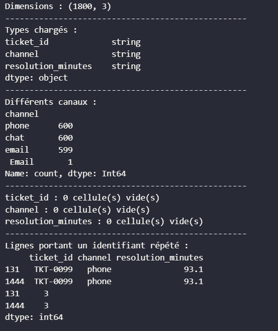
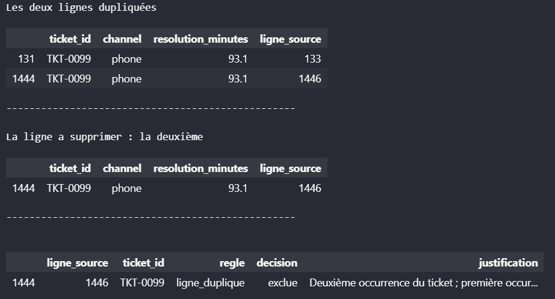
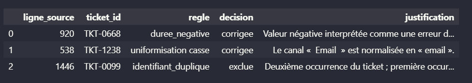
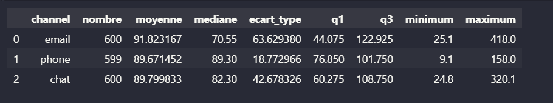
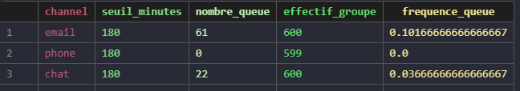

### Notes de nettoyage

Le fichier brut reste inchangé, les correctiosn sont faites sur une copie.  
Le fichier nettoyé ne contient que les données pour analyse et aucune durée invalide ne doit entrer dans les calculs.

#### Ligne identique
- même identifiant
- autres valeurs sont les identiques
$\rightarrow$ suppression d'une des deux lignes : si Màj garder la dernière sinon la première écrite.
Ici je décide de conserver la première ligne.
> Conservation d'une trace de la ligne supprimée avec un masque

#### Résumé journal nettoyage :

- valeur vide : exclue ;
- texte non convertible : exclu ;
- valeur négative : corrigée avec sa valeur absolue, car elle est interprétée comme une erreur de saisie.
- normalisation des strings (suppr. espace et bas de casse) pour les canaux
- vérification avec une RegEX des identifiants : TKT-0000

> La ligne source permet une traçabilité et de retrouver la ligne dans le fichier brut  
> Et permet de faire correspondre les première lignes de chaques format : ligne 0 du df -> la 2 du csv (en-tête étant la 1)

#### Valeurs rares :

Une durée élevée n’est pas automatiquement une erreur. Elle peut être inhabituelle mais plausible. Elle est donc conservée et signalée dans l’analyse.

> Les valeurs rares plausibles sont conservées. Elles seront étudiées dans les graphiques et pourront influencer la moyenne, l’écart-type et la forme des distributions.

### Notes d'analyse

#### Email

Les durées sont les plus dispersées. La moyenne est beaucoup plus élevée que la médiane :
Cela indique une distribution étirée vers les grandes durées. Plusieurs tickets dépassent 200 minutes, avec des valeurs allant jusqu’à 418 minutes.

Le canal email possède donc un centre comparable aux autres canaux, mais une forme très différente : davantage de valeurs extrêmes et une forte asymétrie vers la droite.

#### Phone

Les durées sont très regroupées autour de 90 minutes. La moyenne et la médiane sont presque identiques, ce qui indique une distribution relativement équilibrée.

C’est le canal le moins dispersé. Les tickets sont généralement compris entre environ 77 et 102 minutes, même si quelques valeurs plus élevées existent.

#### Chat

Les durées sont plus dispersées que pour phone. La médiane est inférieure à la moyenne, ce qui montre que quelques tickets longs tirent la moyenne vers le haut.

La majorité des durées se situe entre environ 60 et 110 minutes, avec quelques valeurs supérieures à 180 minutes.

#### Conclusion 

Les trois canaux ont des durées moyennes proches de 90 minutes. Toutefois, la moyenne seule est insuffisante :

- phone est le canal le plus régulier ;
- chat présente une dispersion intermédiaire ;
- email est le plus variable et contient les durées les plus longues.  

On ne peut donc pas dire que les canaux ont exactement les mêmes performances. Ils ont un centre similaire, mais des dispersions et des valeurs inhabituelles très différentes.

### Fréquence de dépassement du seuil (180 minutes)

**Observation :** le canal email atteint le seuil de 180 minutes bien plus souvent que les autres (10,2 % contre 3,7 % pour chat et 0 % pour phone).

**Preuve :** 61 tickets email sur 600 dépassent 180 minutes, contre 22/600 pour chat et 0/599 pour phone.

**Limite :** cette fréquence ne dit rien sur la cause de l'écart entre canaux (charge de travail, complexité des demandes, effectifs disponibles...) ; une proportion plus élevée ne prouve pas une moins bonne performance du canal.

**Prochaine vérification :** croiser ce résultat avec le journal de qualité (02) pour s'assurer que les exclusions n'ont pas retiré plus de valeurs extrêmes dans un canal que dans un autre, ce qui biaiserait la comparaison.

> Ce résultat est cohérent avec les notes d'analyse ci-dessus : email est déjà identifié comme le canal le plus variable et contenant les durées les plus longues (jusqu'à 418 minutes). La fréquence de queue confirme ce constat par un autre angle, sans l'expliquer.

### NaN et exclusion silencieuce (pas le cas ici) : 

En pandas, "channel" == quelque_chose renvoie toujours False pour une ligne où channel vaut NaN — même en comparant NaN == NaN. Donc si .unique() retourne bien NaN comme une des valeurs, la boucle essaiera de faire groupe["channel"] == nan, qui ne sélectionnera aucune ligne. Ces tickets sont silencieusement exclus de tous les groupes, et effectif_groupe.sum() devient inférieur à len(tickets_nettoyes).

